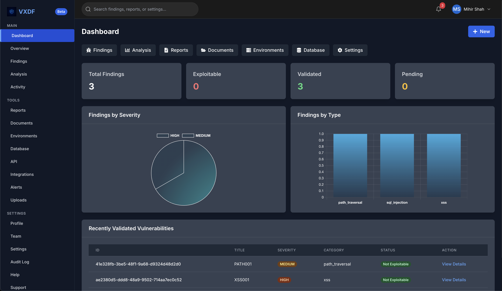
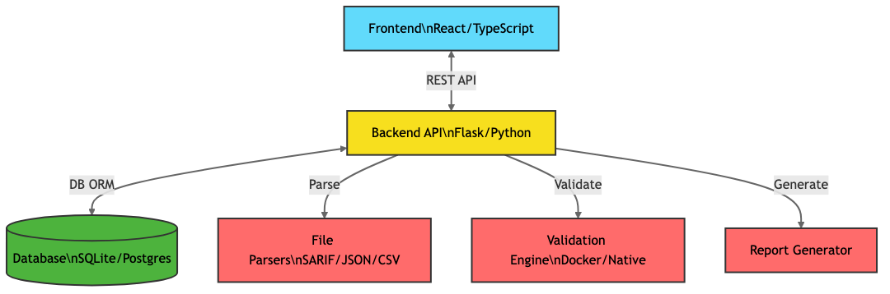

#  VXDF


---

## 🖼️ Demo



*VXDF Dashboard*

---

> **VXDF (Validated eXploitable Data Flow)** is a next-generation security validation platform for verifying, validating, and reporting on security findings from any scanner.

---

## 📑 Table of Contents
- [Overview](#overview)
- [Screenshots](#screenshots)
- [Architecture](#architecture)
- [Key Features](#key-features)
- [Project Structure](#project-structure)
- [Installation](#installation)
- [Running the Application](#running-the-application)
- [Dynamic Configuration](#dynamic-configuration)
- [Documentation](#documentation)
- [License](#license)
- [Author](#author)

---

## 📝 Overview
VXDF Validate helps security professionals validate findings from any scanner, automate exploitability checks, and generate standardized, actionable reports. The platform is fully API-driven, highly modular, and features a beautiful, modern UI.


---

## 🏗️ Architecture




---

## ✨ Key Features
- **Dynamic, API-driven UI**: All data, navigation, and alerts are fetched from APIs or config files.
- **Modern Dashboard**: Beautiful charts, animated stats, and glassmorphism design.
- **Modular Sidebar**: Navigation is fully dynamic and easily configurable.
- **File Upload & Parsing**: Supports SARIF, JSON, CSV, and more.
- **Automated Validation**: Exploitability checks for each finding.
- **Standardized Reporting**: VXDF format for easy integration and compliance.
- **Responsive & Accessible**: Works on all modern browsers and devices.

---

## 📁 Project Structure

```
vxdf/
├── api/                # Backend API and core functionality
│   ├── core/           # Core validation engine
│   ├── models/         # Data models
│   ├── parsers/        # Input format parsers
│   └── validators/     # Vulnerability validators
├── frontend/           # React/TypeScript frontend
│   ├── src/assets/     # Logo and images
│   └── ...
├── scripts/            # Utility scripts (optional)
├── docs/               # Documentation & screenshots
```

---

## 🚀 Installation

### Prerequisites
- Python 3.9+
- Node.js 16+ and npm
- Git

### Setup
```bash
git clone https://github.com/your-username/vxdf.git
cd vxdf
pip install -r api/requirements.txt
cd frontend
npm install
cd ..
```

---

## ▶️ Running the Application

### Start the backend (API):
```bash
python3 -m api.server --port 5001
```

### Start the frontend (SPA):
```bash
npm run dev --prefix frontend
```

### Access the app:
- Frontend: [http://localhost:3000](http://localhost:3000)
- API: [http://localhost:5001](http://localhost:5001)
- API Docs: [http://localhost:5001/apidocs](http://localhost:5001/apidocs)

---

## ⚙️ Dynamic Configuration
- **Sidebar navigation**: Driven by `frontend/src/config/sidebarConfig.ts` (or API in future)
- **Dashboard data**: All stats, charts, and tables are fetched from the backend API
- **Branding**: Logo and product name are configurable
- **Alerts/Notifications**: (Planned) Will be fetched from API

---

## 📚 Documentation
- [Startup Guide](docs/STARTUP.md)
- [API Documentation](docs/API.md)
- [VXDF Format](docs/Validated%20Exploitable%20Data%20Flow%20(VXDF)%20Format%20MD.md)

---

## 📝 License

This project is licensed under the Apache License 2.0 — see the [LICENSE](./LICENSE) file for details.


## 👤 Author
Mihir Shah <mihirshah@vxdf.org>

---

## Quickstart for Contributors

1. **Clone the repo and install dependencies:**
   ```bash
   cd api && pip install -r requirements.txt
   cd ../frontend && npm install
   ```

2. **Start the backend:**
   ```bash
   python3 -m api.server --port 5001
   ```

3. **Start the frontend:**
   ```bash
   npm run dev --prefix frontend
   ```

4. **Visit:** [http://localhost:3000](http://localhost:3000)

---

## Troubleshooting
- If you see proxy errors, make sure the backend is running on port 5001.
- If you see port conflicts, kill any processes using ports 5001 or 3000:
  ```bash
  lsof -ti:5001,3000 | xargs kill -9
  ```
- All API endpoints are under `/api/*`.
- The backend is API-only. There are no Flask-rendered pages or templates.

---

## Makefile
A `Makefile` is provided for easy startup and health checks:

- `make dev` — Start both backend and frontend in dev mode.
- `make check` — Run health checks to ensure both servers are up and API endpoints respond.

---

## Backend
- **Entrypoint:** Always start the backend with `python3 -m api.server --port 5001`.
- **API Docs:** Swagger UI is available at `/apidocs` when the backend is running.
- **Environment:** See `api/.env.example` for environment variables.

## Frontend
- **Proxy:** The frontend proxies `/api` requests to `http://localhost:5001` by default.
- **Environment:** See `frontend/.env.example` for environment variables.

---

## Contributing
- Please read the updated onboarding and troubleshooting sections above before opening issues.
- PRs should pass all health checks in the Makefile. 